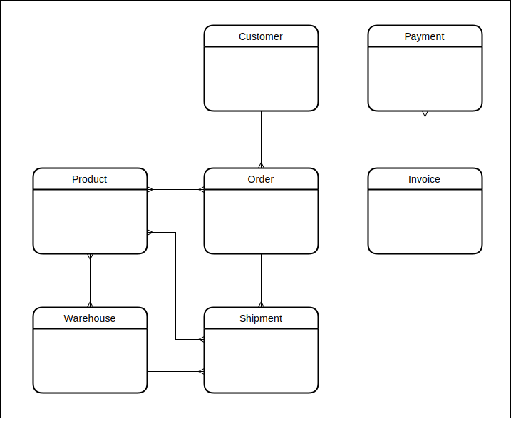

# dynamo-single-table-application

An eCommerce application using a single [DynamoDb](https://aws.amazon.com/dynamodb/) table


- [References](#references)
- [Environment setup](#environment-setup)
- [Testing](#testing)
- [AWS commands](#aws-commands)
- [Table design](#table-design)
  - [ERD](#erd)
  - [Access patterns](#access-patterns)
  - [Key prefixes](#key-prefixes)
  - [Customers](#customers)
  - [Products](#products)
  - [Warehouse](#warehouse)
  - [Orders](#orders)

## References

This work is largely taken from and inspired by the following sources:

- [Fundamentals of Amazon DynamoDB Single Table Design with Rick Houlihan](https://www.youtube.com/watch?v=KYy8X8t4MB8&t=0)
- [amazon-dynamodb-design-patterns](https://github.com/aws-samples/amazon-dynamodb-design-patterns)
- [Single-Table Design with DynamoDB - Alex DeBrie, AWS Data Hero](https://youtu.be/BnDKD_Zv0og?t=0)

## Requirements

- [docker](https://www.docker.com/)
- [localstack](https://localstack.cloud/)
- [awslocal](https://github.com/localstack/awscli-local)

## Environment setup

```bash
yarn local:up

# tear down localstack docker container
yarn local:down
```

## Testing

```bash
yarn test
```

truncate the dynamo table

```bash
yarn purge
```

## AWS commands

```bash
awslocal dynamodb scan --table-name table
awslocal dynamodb scan --table-name table --index-name gsi1
awslocal dynamodb scan --table-name table --index-name gsi2
```

## Table design

### ERD



### Access patterns

1. get customer by customer id
2. get product by product id
3. get warehouse by warehouse id
4. get order by order id
5. get invoice by invoice id (GSI1)
6. get product inventory by product id for all warehouses
7. get shipments by order id
8. get invoice by order id
9. get order items by order id
10. get order items by product id within a date range (GSI1)
11. get shipment by shipment id (GSI1)
12. get shipments by warehouse id (GSI2)
13. get product inventory by warehouse id (GSI1)
14. get invoices by customer id within a date range (GSI2)
15. get order items by customer id within a date range (GSI2)

### Key prefixes

- `c#` = customer
- `p#` = product
- `w#` = warehouse
- `o#` = order
- `i#` = invoice
- `s#` = shipment
- `d#` = shipment item (delivery)

### Customers

sample record

```
{
    "pk": {
        "S": "c#0d7c881e-2f3a-4cac-b88d-b85c6e3730f1"
    },
    "sk": {
        "S": "c#0d7c881e-2f3a-4cac-b88d-b85c6e3730f1"
    },
    "name": {
        "S": "Lorine53"
    },
    "email": {
        "S": "Lincoln.Moen17@gmail.com"
    },
    "entityType": {
        "S": "customer"
    }
}
```

### Products

sample record

```
{
    "pk": {
        "S": "p#bc57f47a-4df6-4a89-9e4e-308b38f31310"
    },
    "sk": {
        "S": "p#bc57f47a-4df6-4a89-9e4e-308b38f31310"
    },
    "name": {
        "S": "vacuum cleaner"
    },
    "price": {
        "N": "908.55"
    },
    "entityType": {
        "S": "product"
    }
},
```

### Warehouse

sample warehouse record

```
{
    "pk": {
        "S": "w#64313598-189d-4974-822c-5a055d6ee0cf"
    },
    "sk": {
        "S": "w#64313598-189d-4974-822c-5a055d6ee0cf"
    },
    "address": {
        "M": {
            "line1": {
                "S": "13192 Jacobi Grove"
            },
            "town": {
                "S": "Buckinghamshire"
            },
            "city": {
                "S": "East Melany"
            },
            "postcode": {
                "S": "25087"
            }
        }
    },
    "entityType": {
        "S": "warehouse"
    }
},
```

sample stock inventory record

```
{
    "pk": {
        "S": "p#22208b4f-9858-4f5b-950b-3429fa985f57"
    },
    "sk": {
        "S": "w#3602495c-75e5-451f-a9a1-5c259b5bcb3e"
    },
    "gsi1_pk": {
        "S": "w#3602495c-75e5-451f-a9a1-5c259b5bcb3e"
    },
    "gsi1_sk": {
        "S": "p#22208b4f-9858-4f5b-950b-3429fa985f57"
    },
    "quantity": {
        "N": "5"
    },
    "entityType": {
        "S": "warehouseStock"
    }
},
```

### Orders

sample order record

```
{
    "pk": {
        "S": "o#eecf9a88-0ef5-477a-8dcd-5a09c565b480"
    },
    "sk": {
        "S": "c#0b96a2f4-9df0-491f-9041-f920e46ac960"
    },
    "date": {
        "S": "2021-09-21T22:44:29.326Z"
    },
    "entityType": {
        "S": "order"
    }
}
```

sample order invoice record

```
{
    "pk": {
        "S": "o#16f79ac3-9046-4e53-8f42-a856a263c099"
    },
    "sk": {
        "S": "i#b3fba4a7-eb94-4195-b432-9010c7bc06e0"
    },
    "gsi1_pk": {
        "S": "i#b3fba4a7-eb94-4195-b432-9010c7bc06e0"
    },
    "gsi1_sk": {
        "S": "i#b3fba4a7-eb94-4195-b432-9010c7bc06e0"
    },
    "gsi2_pk": {
        "S": "c#35c4947c-ed50-4943-ba85-321526f919ca"
    },
    "gsi2_sk": {
        "S": "2021-09-22T17:03:48.842Z"
    },
    "date": {
        "S": "2021-09-22T17:03:48.842Z"
    },
    "amount": {
        "N": "8679"
    },
    "payments": {
        "L": [
            {
                "M": {
                    "type": {
                        "S": "amex"
                    },
                    "amount": {
                        "N": "80459"
                    }
                }
            }
        ]
    },
    "entityType": {
        "S": "invoice"
    }
},
```

order item sample record

```
{
    "pk": {
        "S": "o#9e346e0c-8e44-4088-b212-d42e4cd62c93"
    },
    "sk": {
        "S": "p#06d18c7e-0c30-40fa-9bdc-d50b4ebafae2"
    },
    "gsi1_pk": {
        "S": "p#06d18c7e-0c30-40fa-9bdc-d50b4ebafae2"
    },
    "gsi1_sk": {
        "S": "2021-09-22T17:31:57.136Z"
    },
    "gsi2_pk": {
        "S": "c#64d9d6ae-7559-4186-8213-2236936ccab0"
    },
    "gsi2_sk": {
        "S": "2021-09-22T17:31:57.136Z"
    },
    "quantity": {
        "N": "5"
    },
    "price": {
        "N": "23038"
    },
    "entityType": {
        "S": "orderItem"
    },
},
```

order shipment sample record

```
{
    "pk": {
        "S": "o#68e522e8-48b6-4a0c-9eb6-d3d92352cbf9"
    },
    "sk": {
        "S": "s#162f3190-e302-4ad7-99a4-0f45fc34218c"
    },
    "gsi1_pk": {
        "S": "s#162f3190-e302-4ad7-99a4-0f45fc34218c"
    },
    "gsi2_pk": {
        "S": "w#75678b9a-626a-462a-9c32-0e7ecb990926"
    },
    "gsi2_sk": {
        "S": "s#162f3190-e302-4ad7-99a4-0f45fc34218c"
    },
     "gsi1_sk": {
        "S": "s#162f3190-e302-4ad7-99a4-0f45fc34218c"
    }
    "date": {
        "S": "2021-09-22T16:24:31.074Z"
    },
    "address": {
        "M": {
            "line1": {
                "S": "208 Ritchie Islands"
            },
            "town": {
                "S": "Bedfordshire"
            },
            "city": {
                "S": "Aliso Viejo"
            },
            "postcode": {
                "S": "46022"
            }
        }
    },
    "entityType": {
        "S": "shipment"
    },
    "type": {
        "S": "normal"
    }
},
```

order shipment item sample record

```
 {
    "pk": {
        "S": "o#8d15df01-8b88-4c06-9a05-8076afdbd390"
    },
    "sk": {
        "S": "d#5834894c-e528-4c7f-b989-9e28c08e6e71"
    },
    "productId": {
        "S": "13d8acb6-a811-4b3c-b243-359b4f0245e0"
    },
    "shipmentId": {
        "S": "4c3af2cc-a376-4e5e-a048-fd3e10a58ae5"
    },
    "quantity": {
        "N": "3"
    },
    "entityType": {
        "S": "shipmentItem"
    }
},
```
